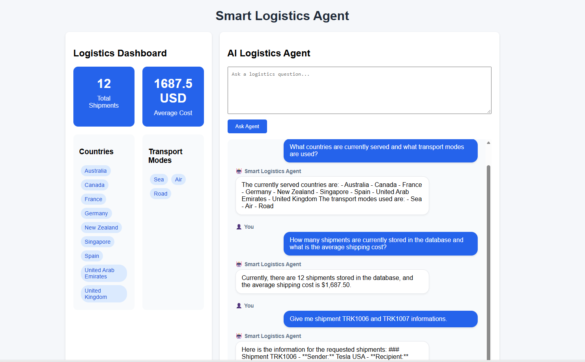
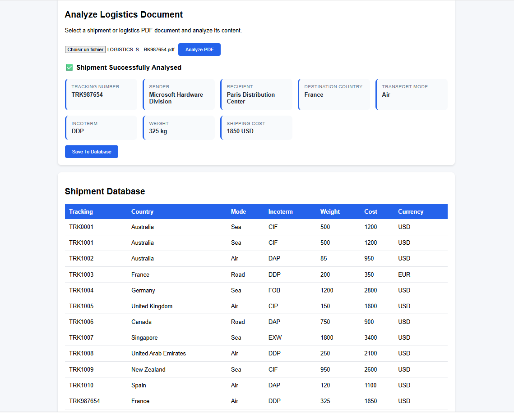
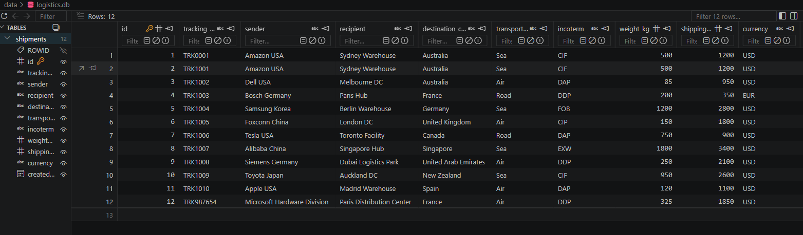
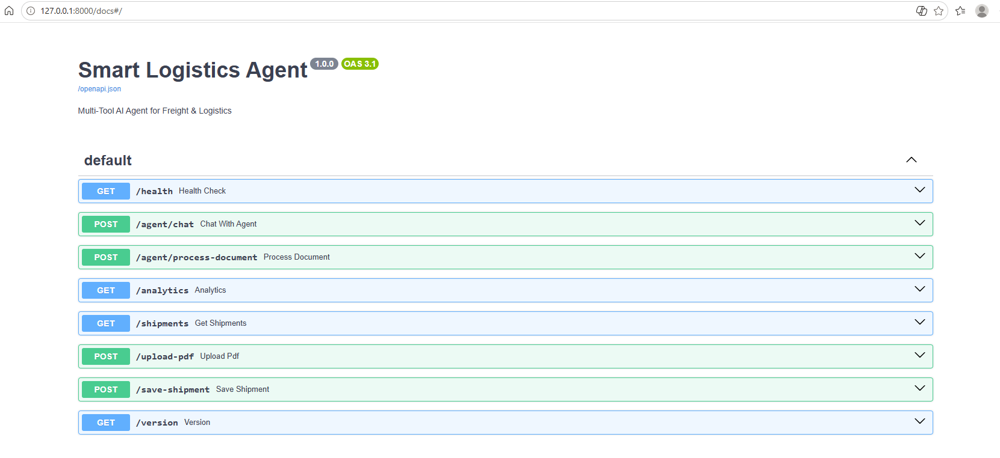

# Smart Logistics Agent

https://img.shields.io/badge/Python-3.12-blue
![FastAPI](httpslds.io/badge/FastAPI-API-green
![OpenAI](https://img.shields.io/badge/OpenAI-Function_Cck
![SQLiteimg.shields.io/badge/SQLite-Database-blue
![Dockerimg.shields.io/badge/Docker-Containerized-blue

AI-powered freight and logistics assistant built with FastAPI, OpenAI Function Calling, SQLAlchemy, SQLite and Docker.

The application combines conversational AI, document intelligence and shipment management into a single workflow.

Users can:

- Query shipment data using natural language
- Analyze logistics PDF documents
- Extract structured shipment information with AI
- Save shipments to a database
- Monitor logistics KPIs through a dashboard
- Interact with a multi-tool AI agent

---

## Key Features

- AI Logistics Agent
- Multi-Step Tool Execution
- OpenAI Function Calling
- PDF Shipment Analysis
- Shipment Database Management
- Logistics Analytics Dashboard
- FastAPI REST API
- SQLAlchemy & SQLite
- Docker Deployment

---

## Application Screenshots

The following screenshots illustrate the main capabilities of the Smart Logistics Agent, including conversational AI, document processing, shipment management and API integration.

### Dashboard & AI Agent

The AI agent can query the shipment database using natural language and automatically invoke backend tools to retrieve logistics information.



### PDF Analysis & Database Integration

The application can analyze logistics PDF documents, extract structured shipment information using AI, and prepare the data for database insertion.



### Shipment Database

All shipments are stored in a relational database managed through SQLAlchemy and exposed through the FastAPI application.



### REST API Documentation

The backend exposes a fully documented FastAPI interface through Swagger UI.



---

## Project Overview

Freight and logistics operations often rely on multiple disconnected systems for shipment tracking, document processing and operational reporting.

The objective of this project is to demonstrate how a Large Language Model (LLM) can act as an intelligent logistics assistant capable of:

- Answering business questions using natural language
- Retrieving information from a shipment database
- Generating logistics insights and analytics
- Processing freight and shipping documents
- Extracting structured information from unstructured PDF files
- Executing multi-step workflows through tool orchestration

The application combines conversational AI, database operations and document intelligence into a single user experience.

Unlike a traditional chatbot, the Smart Logistics Agent can interact with backend tools, retrieve real shipment data and execute business actions on behalf of the user.

---

## Architecture

The application follows a layered architecture that combines conversational AI, backend services, document processing and database operations.

```text
+----------------------+
|    Frontend UI       |
+----------------------+
            |
            v
+----------------------+
|      FastAPI API     |
+----------------------+
            |
            v
+----------------------+
|   AI Logistics Agent |
|  (OpenAI GPT Model)  |
+----------------------+
            |
            v
+----------------------+
|      Tool Layer      |
+----------------------+
      |           |
      v           v
+-----------+ +-----------+
|  SQLite   | | PDF AI    |
| Database  | | Parsing   |
+-----------+ +-----------+
```

### Core Components

#### Frontend

The frontend provides:

- Logistics analytics dashboard
- AI-powered chat interface
- PDF document analysis
- Shipment database visualization

#### FastAPI Backend

The backend exposes REST endpoints used by the frontend and orchestrates interactions between the AI agent, document processing services and the database.

#### AI Logistics Agent

The AI agent leverages OpenAI Function Calling to dynamically select and execute backend tools based on user requests.

Examples include:

- Shipment retrieval
- Logistics analytics
- Shipment creation
- PDF processing
- Multi-step business workflows

#### Database Layer

Shipment information is stored in a SQLite database and managed through SQLAlchemy ORM.

The database contains shipment records including:

- Tracking number
- Sender
- Recipient
- Destination country
- Transport mode
- Incoterm
- Weight
- Shipping cost
- Currency

#### Document Intelligence

PDF logistics documents can be uploaded, analyzed and converted into structured shipment records.

Extracted information can then be reviewed and inserted into the shipment database directly from the application.

---

## Technology Stack

### Backend

- Python 3.12
- FastAPI
- Uvicorn
- SQLAlchemy
- Pydantic

### AI & Document Processing

- OpenAI API
- GPT Function Calling
- Multi-Tool Orchestration
- PDF Parsing

### Database

- SQLite
- SQLAlchemy ORM

### Frontend

- HTML5
- CSS3
- Vanilla JavaScript

### DevOps

- Docker
- Docker Compose

### Documentation

- Swagger UI
- OpenAPI

---

## Installation

### Clone the Repository

```bash
git clone https://github.com/LeoDaVinci280/smart-logistics-agent.git

cd smart-logistics-agent
```

### Create a Virtual Environment

```bash
python -m venv .venv
```

### Activate the Virtual Environment

Windows:

```bash
.venv\Scripts\activate
```

Linux / macOS:

```bash
source .venv/bin/activate
```

### Install Dependencies

```bash
pip install -r requirements.txt
```

### Environment Variables

Create a `.env` file at the root of the project:

```env
OPENAI_API_KEY=your_openai_api_key
```

### Run the Application

```bash
uvicorn src.main:app --reload
```

The API will be available at:

```text
http://localhost:8000
```

Swagger documentation:

```text
http://localhost:8000/docs
```

---

## Docker Deployment

### Build the Docker Image

```bash
docker compose build
```

### Start the Application

```bash
docker compose up
```

The FastAPI application will be available at:

```text
http://localhost:8000
```

Swagger UI:

```text
http://localhost:8000/docs
```

### Stop the Application

```bash
docker compose down
```

---

## Example Workflows

### Shipment Analytics

Ask the AI agent:

```text
How many shipments are currently stored in the database?
```

Example response:

```text
There are currently 13 shipments in the database.
```

---

### Destination Countries

Ask:

```text
List all destination countries.
```

Example response:

```text
Australia
Canada
France
Germany
New Zealand
Singapore
Spain
United Arab Emirates
United Kingdom
```

---

### Shipment Lookup

Ask:

```text
Give me shipment TRK1006 information.
```

Example response:

```text
Tracking Number: TRK1006
Sender: Tesla USA
Recipient: Toronto Facility
Destination Country: Canada
Transport Mode: Road
Incoterm: DAP
Weight: 750 kg
Shipping Cost: 900 USD
```

---

### PDF Analysis Workflow

1. Upload a logistics PDF document.
2. Click **Analyze PDF**.
3. Review the extracted shipment information.
4. Click **Save To Database**.
5. The dashboard and shipment table are automatically refreshed.

---

## Future Improvements

Potential next enhancements include:

- Advanced shipment filtering and search
- Interactive charts and logistics analytics
- Enhanced chat interface with persistent conversation history
- Shipment editing and deletion workflows
- PostgreSQL support
- Authentication and user management
- Cloud deployment (Azure / AWS)
- Automated document processing pipelines
- Support for additional logistics document formats

---

## Conclusion

Smart Logistics Agent demonstrates how Large Language Models can be integrated into business applications to combine conversational interfaces, document intelligence and operational data management.

The project showcases the implementation of an AI-powered logistics assistant capable of retrieving shipment information, analyzing freight documents, executing business workflows and interacting with a real database through OpenAI Function Calling.